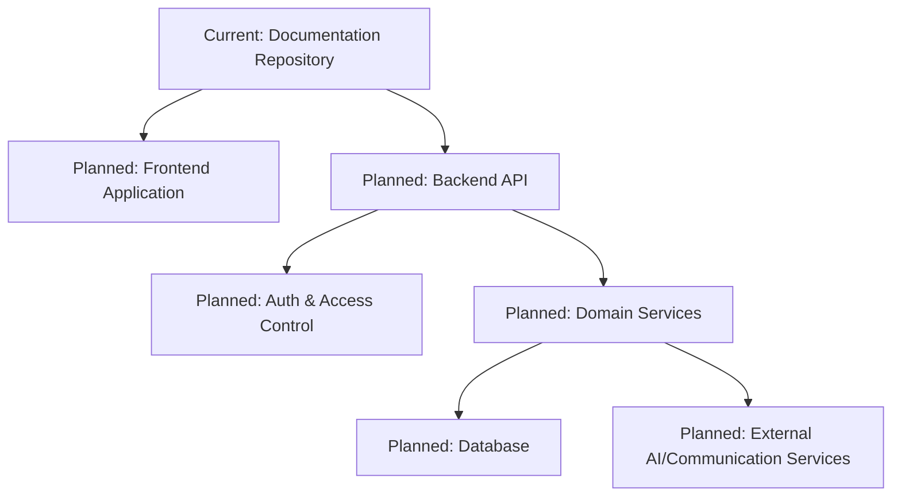
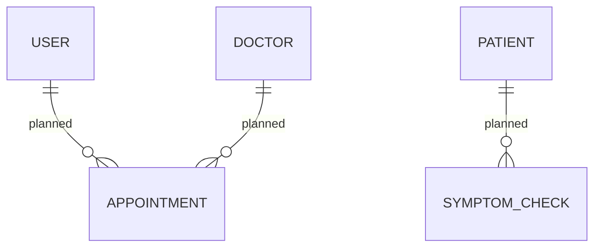

# CuraLink

### Connected Care Platform Design for Telehealth Workflows

> CuraLink is currently a documentation-first healthcare platform concept repository with security and licensing policies in place, preparing for full-stack implementation.


[](./LICENSE)

---

## 1) Project Overview

CuraLink defines a product direction for a healthcare coordination platform focused on symptom triage, appointment workflows, and clinician-patient communication. At this stage, the repository contains project documentation and policies, not runnable application code.

| Problem Area | CuraLink Direction | Current State |
| --- | --- | --- |
| Fragmented digital care journeys | Unified patient-doctor workflow concept | 🗺️ Planned |
| Delayed access to consultation | Booking + triage oriented product vision | 🗺️ Planned |
| Security reporting ambiguity | Dedicated vulnerability disclosure policy | ✅ Implemented (`SECURITY.md`) |

---

## 2) Why CuraLink?

From an engineering perspective, this repository is structured as an early foundation emphasizing:

- clear product direction before implementation
- explicit open-source licensing
- responsible vulnerability reporting workflow
- transparent status signaling (implemented vs planned)

---

## 3) Core Features

| Module | Capabilities | Status |
| --- | --- | --- |
| Repository Governance | MIT licensing, ignore policy | ✅ Implemented |
| Security Policy | Private vulnerability reporting instructions | ✅ Implemented |
| Authentication | No code present yet | 🗺️ Planned |
| Patient/Doctor Workflows | No code present yet | 🗺️ Planned |
| Appointment Scheduling | No code present yet | 🗺️ Planned |
| Real-time Communication | No code present yet | 🗺️ Planned |
| AI Symptom Triage | No code present yet | 🗺️ Planned |

---

## 4) User Roles & Permissions

No role system is implemented in code yet.

| Role | Capability State |
| --- | --- |
| Patient | 🗺️ Planned |
| Doctor | 🗺️ Planned |
| Admin | 🗺️ Planned |

---

## 5) System Architecture

### Current repository architecture

```text
Repository Root
   ├── README.md      (product/engineering documentation)
   ├── SECURITY.md    (vulnerability reporting policy)
   ├── LICENSE        (MIT license)
   └── .gitignore     (development artifact exclusions)
```

### Target application architecture (planned)

```text
Client UI
   ↓
Frontend Application
   ↓
API Layer
   ↓
Auth + Authorization Middleware
   ↓
Domain Services
   ↓
Database / External Integrations
```

---

## 6) Architecture Diagram



---

## 7) Request / Data Flow

No request-processing code exists yet.

Planned request flow:

```text
User
 ↓
Frontend
 ↓
API Endpoint
 ↓
Middleware (auth/validation)
 ↓
Controller/Service
 ↓
Database
 ↓
Response
```

---

## 8) Technology Stack

There is no implemented application stack in this repository yet.

| Layer | Technology |
| --- | --- |
| Implemented Today | Markdown documentation, MIT license, security policy |
| Application Runtime | 🗺️ Planned |
| Frontend Framework | 🗺️ Planned |
| Backend Framework | 🗺️ Planned |
| Database | 🗺️ Planned |
| Testing Framework | 🗺️ Planned |
| Deployment Platform | 🗺️ Planned |

---

## 9) Engineering Highlights

Implemented highlights in the current repository:

- **Security disclosure workflow** via `SECURITY.md`
- **Clear licensing** via MIT `LICENSE`
- **Repository hygiene baseline** via `.gitignore`
- **Transparent maturity level** documented as planning/early-stage

---

## 10) Security

Current security-related implementation:

- Vulnerability reporting policy in [`SECURITY.md`](./SECURITY.md)
- Guidance to report issues privately through GitHub Security Advisories
- Version support matrix documented for security updates

> This repository does **not** currently include application-layer security controls (e.g., auth middleware, hashing, JWT validation) because no app code is present yet.

---

## 11) Database Design

No database models, schema files, or migrations are present in this repository yet.



_The ER diagram above represents planned conceptual entities, not implemented schema._

---

## 12) API Documentation

No backend routes or OpenAPI/Swagger definitions are currently present.

| Method | Endpoint | Authentication | Description |
| --- | --- | --- | --- |
| — | — | — | API surface not implemented yet |

---

## 13) Project Structure

```text
CuraLink/
├── .gitignore
├── LICENSE
├── README.md
└── SECURITY.md
```

---

## 14) Installation & Setup

### Prerequisites

```text
git
A markdown viewer (optional)
```

### Clone

```bash
git clone https://github.com/Shubham-cyber-prog/CuraLink.git
cd CuraLink
```

---

## 15) Environment Variables

No `.env.example` or runtime configuration variables are currently defined in the repository.

---

## 16) Running Locally

There are no runnable application services yet.

```bash
# currently no start/build scripts are available in this repository
```

---

## 17) Production Build

Production build configuration is not implemented yet.

---

## 18) Docker

No `Dockerfile` or `docker-compose` configuration is currently present.

---

## 19) Testing

No test framework or test suites are currently present.

> Testing infrastructure is currently being expanded.

---

## 20) Deployment

No deployment configuration files (for Vercel, Railway, Docker, Kubernetes, etc.) are currently present.

---

## 21) Screenshots / Demo

No versioned screenshots, GIFs, or demo assets are currently stored in this repository.

> Product visuals will be added as implementation progresses.

---

## 22) Accessibility

No frontend implementation is available yet, so accessibility behavior cannot be evaluated at this stage.

---

## 23) Error Handling & Observability

No runtime application code is present, so error handling, logging, and observability pipelines are not implemented yet.

---

## 24) Development Philosophy

CuraLink currently demonstrates a documentation-first and policy-first approach:

- establish product direction early
- define security disclosure process early
- keep repository expectations explicit and truthful
- evolve toward implementation in incremental milestones

---

## 25) Roadmap

- [x] Initialize repository baseline (`README.md`, `LICENSE`, `.gitignore`)
- [x] Add security policy (`SECURITY.md`)
- [ ] Add frontend application scaffold
- [ ] Add backend API scaffold
- [ ] Implement authentication and authorization
- [ ] Implement patient-doctor workflow modules
- [ ] Add data schema and migrations
- [ ] Add tests and CI workflows
- [ ] Add deployment configuration

---

## 26) Known Limitations

- No application source code exists yet.
- No API endpoints are implemented.
- No database schema is implemented.
- No test suite or CI pipeline is present.
- No deployment assets are present.

---

## 27) Security Policy

Please see [`SECURITY.md`](./SECURITY.md) for vulnerability reporting guidelines.

---

## 28) Contributing

Contributions are welcome as implementation begins.

```text
Fork
 ↓
Create branch
 ↓
Implement changes
 ↓
Validate locally
 ↓
Commit
 ↓
Open Pull Request
```

---

## 29) License

This repository is licensed under the MIT License. See [`LICENSE`](./LICENSE).

---

## 30) Author / Maintainer

- Repository owner: [@Shubham-cyber-prog](https://github.com/Shubham-cyber-prog)
- Copyright holder listed in [`LICENSE`](./LICENSE): **Subham Nayak**

---

## 31) Project Status

🚧 **Active Planning / Early Development**

The repository currently contains project documentation and policies; implementation work is planned but not yet committed.
