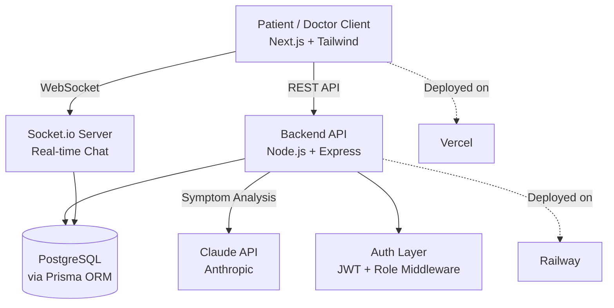
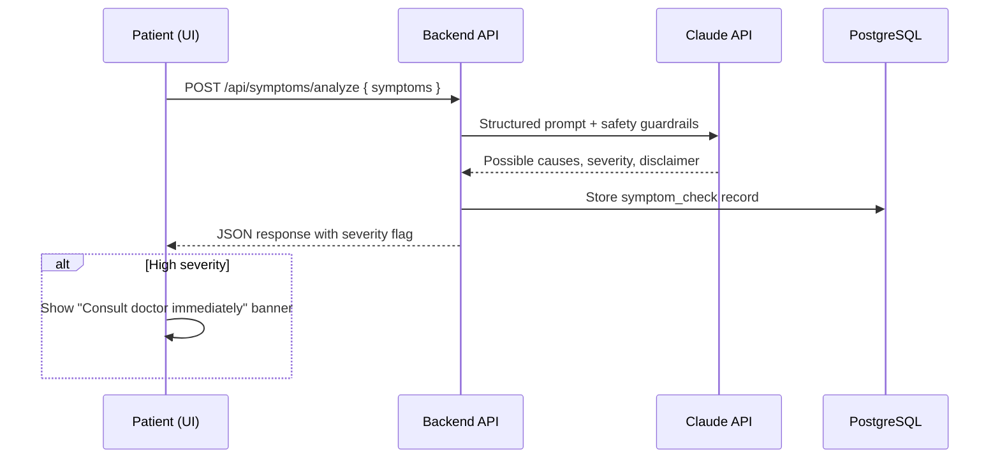

This is a [Next.js](https://nextjs.org) project bootstrapped with [`create-next-app`](https://nextjs.org/docs/app/api-reference/cli/create-next-app).

## Getting Started

First, run the development server:

```bash
npm run dev
# or
yarn dev
# or
pnpm dev
# or
bun dev
```

Open [http://localhost:3000](http://localhost:3000) with your browser to see the result.

You can start editing the page by modifying `app/page.tsx`. The page auto-updates as you edit the file.

This project uses [`next/font`](https://nextjs.org/docs/app/building-your-application/optimizing/fonts) to automatically optimize and load [Geist](https://vercel.com/font), a new font family for Vercel.

## Learn More

To learn more about Next.js, take a look at the following resources:

- [Next.js Documentation](https://nextjs.org/docs) - learn about Next.js features and API.
- [Learn Next.js](https://nextjs.org/learn) - an interactive Next.js tutorial.

You can check out [the Next.js GitHub repository](https://github.com/vercel/next.js) - your feedback and contributions are welcome!

## Deploy on Vercel

The easiest way to deploy your Next.js app is to use the [Vercel Platform](https://vercel.com/new?utm_medium=default-template&filter=next.js&utm_source=create-next-app&utm_campaign=create-next-app-readme) from the creators of Next.js.

Check out our [Next.js deployment documentation](https://nextjs.org/docs/app/building-your-application/deploying) for more details.
<div align="center">

# 🩺 CuraLink


**AI-powered telehealth platform connecting patients and doctors in real time**

*Intelligent symptom triage · Seamless appointment booking · Live consultations*

[](https://nextjs.org/)
[](https://www.typescriptlang.org/)
[](https://www.postgresql.org/)
[](https://www.prisma.io/)
[](https://socket.io/)
[](./LICENSE)
[](CONTRIBUTING.md)

[Live Demo](#) · [Report Bug](../../issues) · [Request Feature](../../issues)

</div>

---

## 📌 Overview

Patients often don't know whether a symptom warrants urgent care, and booking a consultation is slow and fragmented across phone calls, walk-ins, and disconnected systems. **CuraLink** solves this with an AI-assisted symptom triage engine paired with a streamlined booking and real-time communication layer — connecting patients to the right doctor, faster.


---

## 🎥 Demo

<div align="center">

*(Screenshot / GIF walkthrough of symptom checker → booking → chat flow)*

| Symptom Checker | Appointment Booking | Live Chat |
|:---:|:---:|:---:|
|  |  |  |

</div>

---

## ✨ Key Features

| Feature | Description |
|---|---|
| 🔐 **Role-based Access** | Isolated dashboards & permissions for Patients, Doctors, and Admins |
| 🤖 **AI Symptom Triage** | Claude-powered analysis returning possible causes, urgency level & clinical disclaimers |
| 📅 **Smart Scheduling** | Doctors define availability windows; patients book conflict-free slots in real time |
| 💬 **Real-time Messaging** | Socket.io-powered chat per appointment, with typing indicators & read receipts |
| ✅ **Doctor Verification** | Admin-gated onboarding to ensure platform trust & credential checks |
| 📊 **Symptom History** | Patients can track past AI assessments over time |
| 🎥 **Video Consultation** *(roadmap)* | Twilio-based in-app video calls |

---

## 🏗️ System Architecture



<details>
<summary><b>Data Flow — Symptom Check Request</b></summary>



</details>

---

## 🛠️ Tech Stack

<table>
<tr>
<td valign="top" width="33%">

**Frontend**
- Next.js 15 (App Router)
- TypeScript
- Tailwind CSS
- React Hook Form + Zod

</td>
<td valign="top" width="33%">

**Backend**
- Node.js + Express
- Prisma ORM
- PostgreSQL
- Socket.io
- JWT Authentication

</td>
<td valign="top" width="33%">

**Infra & AI**
- Claude API (Anthropic)
- Vercel (frontend hosting)
- Railway (backend + DB)
- GitHub Actions (CI/CD)
- Jest + React Testing Library

</td>
</tr>
</table>

---

## 🚀 Getting Started

### Prerequisites

```
Node.js >= 20.x
PostgreSQL >= 15
npm or pnpm
```

### 1. Clone & Install

```bash
git clone https://github.com/<your-username>/curalink.git
cd curalink
npm install
```

### 2. Environment Setup

```bash
cp .env.example .env.local
```

| Variable | Description |
|---|---|
| `DATABASE_URL` | PostgreSQL connection string |
| `CLAUDE_API_KEY` | Anthropic API key for symptom analysis |
| `JWT_SECRET` | Secret for signing auth tokens |
| `NEXT_PUBLIC_SOCKET_URL` | Socket.io server URL |

### 3. Database Setup

```bash
npx prisma migrate dev
npx prisma generate
```

### 4. Run Development Server

```bash
npm run dev
```

App runs at `http://localhost:3000`

---

## 🧪 Testing & Quality

```bash
npm test              # Run unit tests
npm run test:coverage # Coverage report
npm run lint          # ESLint check
```

CI pipeline (GitHub Actions) runs lint + tests on every push and pull request. See [`.github/workflows/ci.yml`](.github/workflows/ci.yml).

---

## 📂 Project Structure

```
curalink/
├── src/
│   ├── app/                # Next.js App Router pages
│   │   ├── (auth)/         # Login, register
│   │   ├── (patient)/      # Patient dashboard, symptom checker, appointments
│   │   ├── (doctor)/       # Doctor dashboard, availability
│   │   └── (admin)/        # Doctor verification panel
│   ├── components/         # Reusable UI components
│   ├── lib/                # API clients, socket setup, utils
│   └── server/
│       ├── routes/         # Express route handlers
│       ├── services/       # Claude API integration, business logic
│       ├── middleware/     # Auth & role guards
│       └── prisma/         # schema.prisma, migrations
├── tests/
├── .github/workflows/
└── README.md
```

---

## 🗺️ Roadmap

- [x] Project scaffolding (Next.js + TypeScript + Tailwind)
- [ ] Authentication & role-based dashboards
- [ ] Doctor availability & booking engine
- [ ] AI symptom checker (Claude integration)
- [ ] Real-time chat (Socket.io)
- [ ] CI/CD pipeline + deployment
- [ ] Video consultations (Twilio)
- [ ] Real-world pilot with local clinic feedback

Track progress in [Issues](../../issues) and [Projects](../../projects).

---

## 🤝 Responsible AI

CuraLink's symptom checker is built as a **preliminary guidance tool — not a diagnostic system**:

- Every response includes a mandatory disclaimer to consult a licensed physician
- Severity classification is intentionally conservative to avoid under-triaging
- No response ever states a definitive diagnosis — only possible causes
- Symptom history is stored securely and never shared without patient consent

---

## 🤝 Contributing

Contributions, issues, and feature requests are welcome. Check the [issues page](../../issues) or open a PR.

```bash
git checkout -b feature/your-feature
git commit -m "Add: your feature description"
git push origin feature/your-feature
```

---

## 📄 License

Distributed under the MIT License. See [`LICENSE`](./LICENSE) for details.

---

<div align="center">

**Built with ❤️ by [Your Name]**

[LinkedIn](#) · [Portfolio](#) · [Twitter](#)

</div>
>>>>>>> b68533d1ae049514c9e2a84a4234484270a0bb0c
