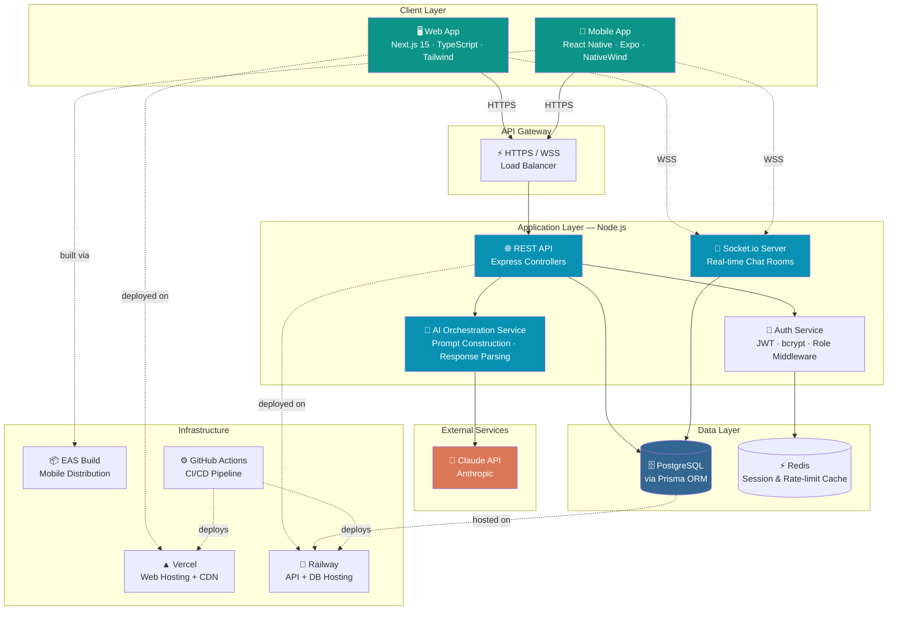
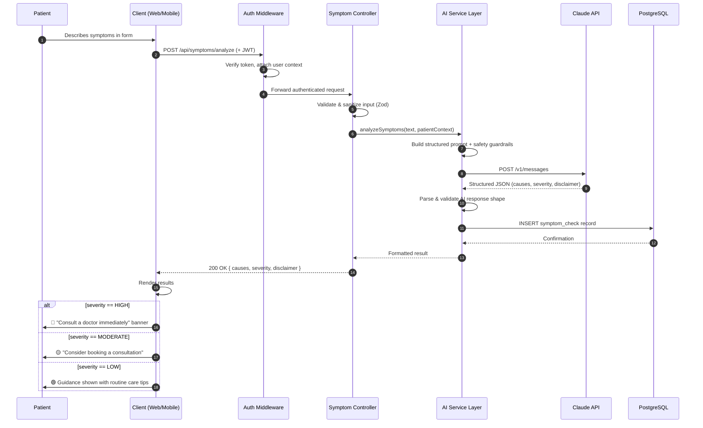
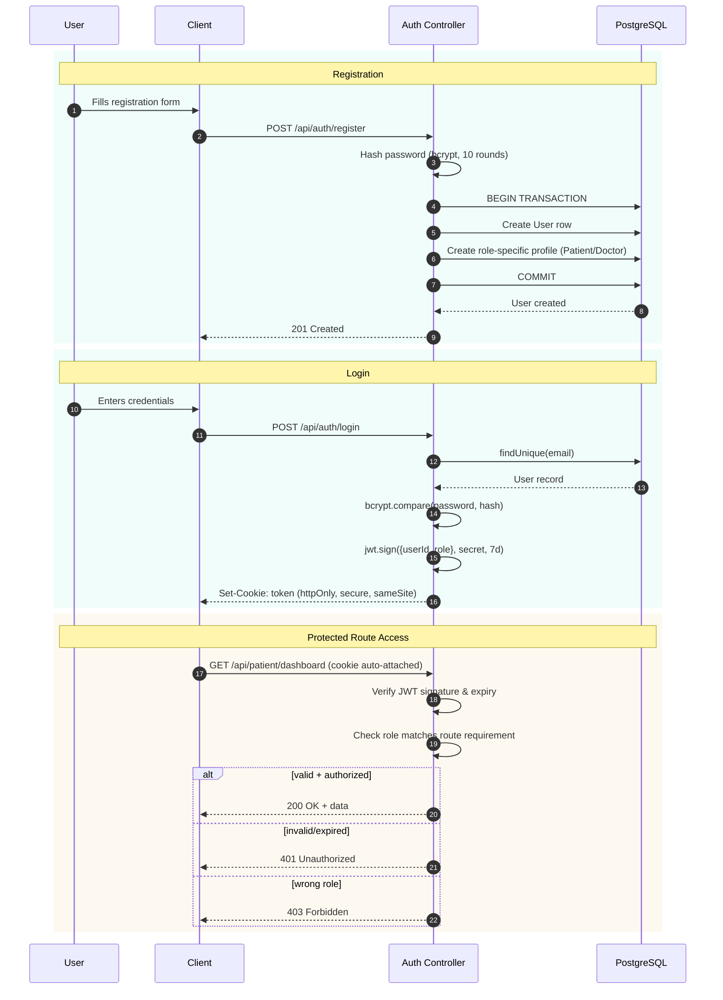
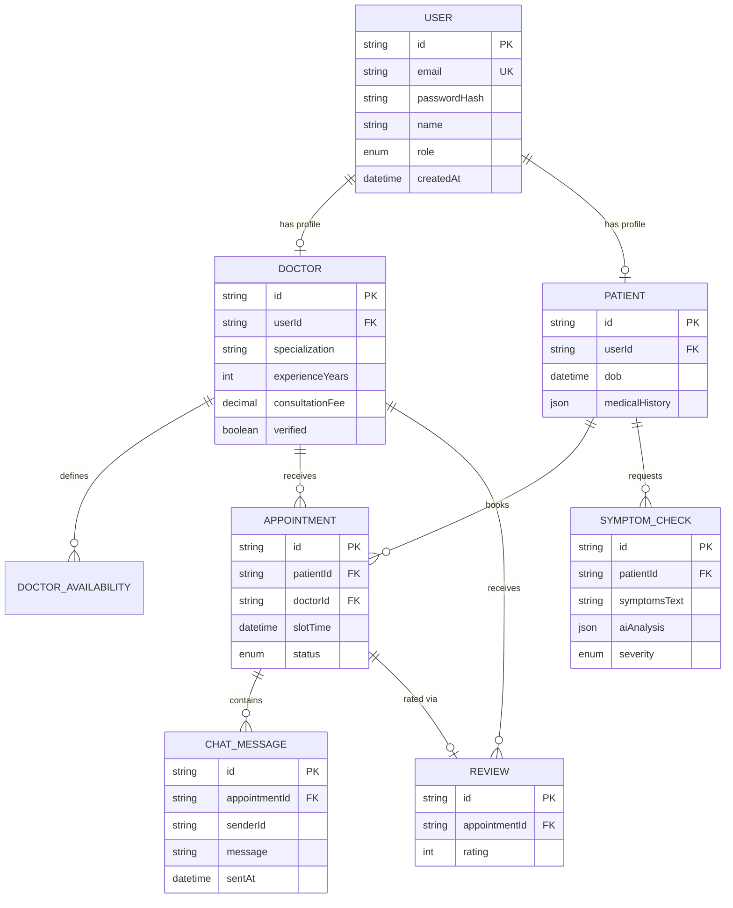
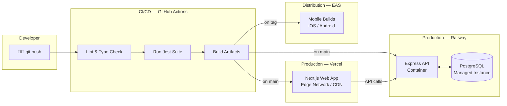

<div align="center">


# 🩺 CuraLink

**AI-powered telehealth platform connecting patients and doctors in real time**

*Intelligent symptom triage · Seamless appointment booking · Live consultations · Web & Mobile*

[](https://nextjs.org/)
[](https://www.typescriptlang.org/)
[](https://expo.dev/)
[](https://www.postgresql.org/)
[](https://www.prisma.io/)
[](https://socket.io/)
[](https://www.anthropic.com/)
[](./LICENSE)
[](../../actions)

[Live Demo](#) · [Report Bug](../../issues) · [Request Feature](../../issues)

</div>

---

## 📌 Overview

Patients often don't know whether a symptom warrants urgent care, and booking a consultation is slow and fragmented across phone calls, walk-ins, and disconnected systems.

**CuraLink** solves this with an AI-assisted symptom triage engine paired with a streamlined booking flow and real-time communication layer — connecting patients to the right doctor, faster. It ships as both a **web app** and a **native mobile app**, sharing a single backend.

> ⚠️ CuraLink's AI provides **preliminary informational guidance only** and is explicitly designed to never replace professional medical diagnosis. See [Responsible AI](#-responsible-ai).

---

## ✨ Key Features

| Feature | Status | Description |
|---|:---:|---|
| 🔐 **Role-based Authentication** | ✅ Live | JWT-based auth with isolated flows for Patients, Doctors, and Admins |
| 📱 **Cross-platform Client** | 🚧 In Progress | Web app (Next.js) + native mobile app (React Native/Expo) sharing one API |
| 🤖 **AI Symptom Triage** | 🚧 In Progress | Claude-powered analysis returning possible causes, urgency level & clinical disclaimers |
| 📅 **Smart Scheduling** | 🚧 In Progress | Doctors define availability windows; patients book conflict-free slots in real time |
| 💬 **Real-time Messaging** | 🔜 Planned | Socket.io-powered chat per appointment, with typing indicators |
| ✅ **Doctor Verification** | 🔜 Planned | Admin-gated onboarding to ensure platform trust |
| 📊 **Symptom History** | 🔜 Planned | Patients can track past AI assessments over time |

---

## 🏗️ Architecture

CuraLink follows a **layered, API-first architecture** — a single backend serves both the web and mobile clients, keeping business logic centralized and consistent across platforms.

### High-Level System Design



---

### Request Lifecycle — Symptom Analysis (end-to-end)



---

### Authentication & Authorization Flow



---

### Database Entity Relationship Diagram



---

### Deployment Topology



---

### Why These Design Decisions

| Decision | Reasoning |
|---|---|
| **Single backend for web + mobile** | One source of truth for business logic; avoids duplicating validation, auth, and AI-orchestration code across platforms |
| **JWT in httpOnly cookies (web) / SecureStore (mobile)** | Mitigates XSS token theft on web; avoids plaintext storage on device |
| **Service layer between controllers and Claude API** | Isolates prompt engineering and response parsing from HTTP concerns — makes the AI logic independently testable |
| **Prisma transactions for User + Profile creation** | Guarantees atomicity — a user is never left in a half-created state if profile creation fails |
| **Severity-based conditional UI (not just raw text)** | Forces a consistent, conservative safety response across the entire app rather than relying on prompt output alone |

---

## 🛠️ Tech Stack

<table>
<tr>
<td valign="top" width="25%">

**Web Frontend**
- Next.js 15 (App Router)
- TypeScript
- Tailwind CSS

</td>
<td valign="top" width="25%">

**Mobile Frontend**
- React Native (Expo)
- Expo Router
- NativeWind

</td>
<td valign="top" width="25%">

**Backend**
- Node.js + Express
- Prisma ORM
- PostgreSQL
- Socket.io
- JWT Authentication

</td>
<td valign="top" width="25%">

**Infra & AI**
- Claude API (Anthropic)
- Vercel · Railway
- GitHub Actions (CI/CD)
- Jest

</td>
</tr>
</table>

---

## 🚀 Getting Started

### Prerequisites

```
Node.js >= 20.x
PostgreSQL >= 15
npm
```

### 1. Clone & Install (Web + Backend)

```bash
git clone https://github.com/Shubham-cyber-prog/CuraLink.git
cd CuraLink
npm install
```

### 2. Environment Setup

```bash
cp .env.example .env.local
```

> 🔐 Keep real credentials in `.env.local` (or deployment secrets manager) only. Never commit production keys or OAuth client secrets.

| Variable | Description |
|---|---|
| `DATABASE_URL` | PostgreSQL connection string |
| `CLAUDE_API_KEY` | Anthropic API key for symptom analysis |
| `JWT_SECRET` | Secret for signing auth tokens |
| `GOOGLE_OAUTH_CLIENT_ID` | Google OAuth web client ID |
| `GOOGLE_OAUTH_CLIENT_SECRET` | Google OAuth web client secret (store securely, never commit) |
| `NEXT_PUBLIC_API_URL` | Base URL for web client API requests |
| `NEXT_PUBLIC_SOCKET_URL` | Socket.io server URL |
| `EXPO_PUBLIC_API_URL` | Base URL for mobile client API requests |

### 3. Database Setup

```bash
npx prisma migrate dev
npx prisma generate
```

### 4. Run the Web App

```bash
npm run dev
```

App runs at `http://localhost:3000`

### 5. Run the Mobile App

```bash
cd mobile
npm install
npx expo start
```

Scan the QR code with **Expo Go** on your device.

---

## 🧪 Testing & Quality

```bash
npm test              # Run unit + integration tests
npm run lint           # ESLint check
```

CI pipeline (GitHub Actions) runs lint + tests on every push and pull request. See [`.github/workflows/ci.yml`](.github/workflows/ci.yml).

---

## 📂 Project Structure

```
CuraLink/
├── app/                     # Next.js App Router (web frontend)
│   ├── login/               ├── register/
│   ├── forgot-password/     └── reset-password/
├── components/
│   └── auth/                # Auth forms, password strength, layout
├── src/                     # Express backend
│   ├── controllers/         ├── services/
│   ├── middleware/          # Auth, role, error handling
│   ├── routes/               ├── validators/
│   └── utils/                # JWT, password hashing, error helpers
├── prisma/
│   ├── schema.prisma
│   └── migrations/
├── mobile/                  # React Native (Expo) app
│   └── src/
│       ├── app/              # Expo Router — (auth), (tabs)
│       ├── components/       ├── lib/
├── tests/
│   ├── unit/                 └── integration/
├── .github/workflows/ci.yml
└── README.md
```

---

## 🗺️ Roadmap

- [x] Project scaffolding — Next.js + TypeScript + Tailwind
- [x] Authentication system — register/login, JWT, bcrypt, role-based middleware
- [x] Mobile app scaffolding — Expo Router + NativeWind, matching design system
- [x] CI pipeline — lint + tests on push
- [ ] Doctor availability & booking engine
- [ ] AI symptom checker — Claude integration
- [ ] Real-time chat — Socket.io
- [ ] Deployment — Vercel + Railway + custom domain
- [ ] Real-world pilot with local clinic feedback

Track live progress in [Issues](../../issues).

---

## 🤝 Responsible AI

CuraLink's symptom checker is built as a **preliminary guidance tool — not a diagnostic system**:

- Every response includes a mandatory disclaimer to consult a licensed physician
- Severity classification is intentionally conservative to avoid under-triaging
- No response ever states a definitive diagnosis — only possible causes
- Symptom history is stored securely and never shared without patient consent

---

## 🤝 Contributing

Contributions, issues, and feature requests are welcome. Check the [issues page](../../issues) or open a PR.

```bash
git checkout -b feature/your-feature
git commit -m "Add: your feature description"
git push origin feature/your-feature
```

See [`CONTRIBUTING.md`](./CONTRIBUTING.md) for details.

---

## 📄 License

Distributed under the MIT License. See [`LICENSE`](./LICENSE) for details.

---

<div align="center">

**Built by [Subham Nayak](https://github.com/Shubham-cyber-prog)**

</div>
